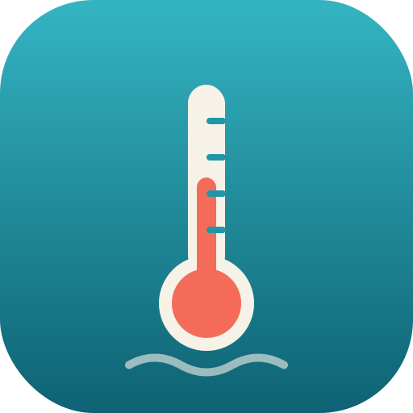

<h1> Trempette</h1>

**→ <https://trempette.app/>**

App web **mobile-first** de consultation des températures des plages des
lacs romands : **Léman, Neuchâtel, Bienne, Morat, Joux**.

Eau (Alplakes / Eawag) + air & vent (open-meteo), pour chaque plage, avec
tendance de réchauffement de l'eau. Tri par lac / « plage la plus chaude » /
favoris, recherche, géolocalisation « plages les plus proches », vue détail.

**PWA** installable, pages **partageables/indexables** par plage
(`/lac/<lac>/<plage>`), **formulaire de contact**, astuces « Le savais-tu ? » et
**générateur de widget iOS** (Scriptable, `/widget/`).

Sur le **Léman**, la température du modèle est **recalée en temps réel** par les
mesures in-situ des bouées LéXPLORE et Buchillon (voir « Correction de biais »).

## Architecture

Un **unique Worker Cloudflare** fait tout :

```
Worker Cloudflare « trempette »
   ├─ sert le site statique (public/, binding ASSETS)
   ├─ Cron Trigger toutes les 30 min  → régénère les données → KV
   │     ├─ Alplakes   → température de l'eau (pas de CORS → appel côté serveur)
   │     ├─ open-meteo → air + vent (un seul appel groupé)
   │     ├─ interpolation linéaire à l'instant présent (+ tendance °C/h)
   │     ├─ Léman : correction de biais via 2 bouées in-situ live (Datalakes)
   │     └─ historique du biais → KV (clé "history", pour le moniteur)
   ├─ GET /data.json → renvoyé depuis KV (run_worker_first)
   ├─ POST /e        → events de consultation → Analytics Engine (stats par plage)
   ├─ POST /contact  → formulaire de contact (Resend + Turnstile)
   ├─ /lac/<lac>/<plage> → pages partageables/indexables (meta OG injectées)
   └─ /admin → back-office protégé (correction · stats · plages · astuces)
```

- **Pas de proxy, pas de backend.** L'app ne fait que lire `/data.json`.
- **Alplakes n'expose pas de CORS** → impossible à appeler depuis le navigateur,
  d'où le pré-calcul côté Worker (cron) stocké dans KV.
- **open-meteo** accepte le CORS, mais on le récupère aussi côté Worker pour
  n'avoir qu'un seul fichier à lire côté client.
- **Déploiement** : intégration Git Cloudflare (Workers Builds) — `git push` sur
  `main` → build + déploiement automatiques.

## Détails techniques

- **Eau** : `GET /simulations/point/{model}/{lake}/{début}/{fin}/0.2/{lat}/{lng}?variables=temperature`
  (dates `YYYYmmddHHMM` UTC, profondeur ~0,2 m). Alplakes ne donne qu'un point
  toutes les ~3 h : on récupère une fenêtre (−6 h à +30 h) et on **interpole
  linéairement** à maintenant ; la pente donne la **tendance** (°C/h). Les
  simulations n'étant mises à jour qu'**1×/jour**, la fenêtre brute est mise en
  cache (KV `windows`) et re-téléchargée au nouveau run (ou si elle ne couvre plus
  l'instant présent).
- **Modèles par lac** : Léman `delft3d-flow/geneva`, Neuchâtel `mitgcm/neuchatel`,
  Bienne `delft3d-flow/biel`, Morat `delft3d-flow/murten`, Joux `delft3d-flow/joux`.
  Liste complète : <https://alplakes-api.eawag.ch/simulations/metadata>.
- **Air & vent** : `current=temperature_2m,wind_speed_10m,wind_direction_10m&wind_speed_unit=kmh`.
- **Plages** : catalogue dans `scripts/lakes.json` (points dans l'eau, au large).
- **Plan gratuit** : Alplakes throttle les appels parallèles → récupération
  séquentielle ; `TRIES=1` côté Worker pour rester sous la limite de 50
  sous-requêtes (passer à `TRIES=3` sur Workers Paid).

## Correction de biais (Léman)

Le modèle Alplakes a un biais qui **n'est pas constant** : il dérive selon la
saison et l'heure plutôt que de rester un décalage fixe — d'où l'intérêt de le
mesurer en direct. Nos observations 2026 au Léman (indicatives, sur 1 à 2 stations
et une seule saison) vont dans ce sens : modèle plutôt **trop froid au printemps**
(de l'ordre de +1 à +2 °C), tendant vers ~0 voire **légèrement trop chaud en début
d'été**, avec un **cycle jour/nuit** de l'ordre de 0,5 °C. Sur le Léman, on le
recale en temps réel à partir des **2 seules stations in-situ live du lac**, via
l'API **Datalakes** (Eawag — comme Alplakes, sans CORS → appel côté Worker) :

- **LéXPLORE** (au large de Pully) — chaîne de température, mesure à **1 m** ;
- **Buchillon** (Petit Lac) — série `wt1`, eau à **1 m**.

Les deux sont comparées à **1 m** (le capteur LéXPLORE à 0,25 m, trop proche de la
surface, oscille de ±1,5 °C/h par stratification les jours calmes → instable et peu
représentatif). Les plages, elles, restent affichées à 0,2 m (baignade) : on suppose
le biais du modèle ~uniforme dans le premier mètre.

Principe, à chaque cycle de cron :

1. à chaque bouée : `biais = mesure_in-situ(1 m) − modèle Alplakes(1 m) au même point`,
   le modèle étant interpolé à **l'heure de la mesure** (comparaison à temps égal) ;
2. chaque plage du Léman reçoit une correction par **pondération inverse de la
   distance** (IDW) des 2 biais :

   ```
   correction(plage) = Σᵢ (biaisᵢ / dᵢ²) ∕ Σᵢ (1 / dᵢ²)
   ```

   où `dᵢ` = distance plage ↔ bouée *i*. Le poids en `1/dᵢ²` fait que la bouée la
   plus proche domine : à mi-chemin ~50/50, deux fois plus proche d'une bouée
   ~80/20, et une plage éloignée des deux tend vers leur moyenne ;
3. `eau_corrigée = modèle + correction` (le **prochain point** de prévision est
   décalé du même offset ; la tendance, elle, est inchangée).

**Garde-fous** : une bouée est écartée si l'API échoue ou ne renvoie aucune mesure
récente, si le modèle est indisponible, si la mesure est **périmée** (\>6 h) ou si
le **biais est aberrant** (\>5 °C). Si son flux **traîne** (horodatage figé ≥2 h —
fréquent : pauses de publication d'environ 5 h, LéXPLORE le soir, Buchillon la nuit),
la bouée est seulement signalée **« en retard »** dans le moniteur **mais reste
utilisée** : le biais dérive lentement, donc une mesure de quelques heures reste
fiable, et c'est mieux que retomber sur le modèle brut. Chaque cas est journalisé
(`[bias] …`). Si aucune bouée n'est exploitable, on sert le modèle brut ; la valeur
modèle d'origine est conservée (`waterModel`).

**Limites** : 2 points au large → correction quasi-locale près d'une bouée, sinon
~moyenne du lac ; ne corrige **pas** le sur-réchauffement des hauts-fonds au bord
(aucune bouée ne le voit). Les autres lacs (Neuchâtel, Bienne, Morat, Joux) n'ont
pas de bouée → modèle brut.

## Back-office `/admin`

Protégé par un secret (`ADMIN_TOKEN`), `noindex`. Quatre pages avec nav commune :

- **`/admin`** (= `/admin/correction`) — **Correction biais** : moniteur de
  l'historique (mesure vs modèle, biais et correction appliquée heure par heure).
  Source : clé KV `history`, un point compact par cycle, rétention 90 j.
- **`/admin/stats`** — **Statistiques** de consultation (voir ci-dessous).
- **`/admin/plages`** — éditeur du catalogue des plages (écrit dans KV
  `catalogue` → le run suivant rebâtit `data.json`).
- **`/admin/tips`** — éditeur des astuces « Le savais-tu ? » affichées au hasard
  sur la page d'accueil (KV `tips`).

## Statistiques de consultation

Mesure quelles plages sont consultées, **sans cookie ni donnée personnelle** :

- Le client envoie un ping `POST /e` (`navigator.sendBeacon`) sur **ouverture** de
  détail, **impression** (carte favori vue dans le hero), **favori** et **partage**.
  Le Worker l'enrichit (navigateur, OS, appareil, pays via `request.cf`, referrer,
  mode PWA — **jamais l'IP ni de cookie**) et l'écrit dans **Workers Analytics
  Engine** (dataset `trempette_views`, rétention 90 j).
- **`/admin/stats`** interroge Analytics Engine (API SQL) pour 24 h / 7 j / 30 j :
  top plages, top lacs, activité par jour, heure de la journée,
  navigateur/OS/appareil/pays/provenance — plus les **visites** de **Cloudflare
  Web Analytics** (API GraphQL RUM). Au-delà de 90 j, un **snapshot quotidien**
  (cron → KV `stats-daily`) conserve l'historique par plage (vue « 1 an »).
- Secret/vars : `AE_API_TOKEN` (Account Analytics Read), `CF_ACCOUNT_ID`.

## Développement

```bash
npx wrangler dev                    # Worker + site en local (http://localhost:8787)
npx wrangler dev --test-scheduled   # puis visiter /__scheduled pour tester le cron
```

## Fichiers

| Fichier | Rôle |
|---|---|
| `public/` | App web (index.html, css/, js/, icons/, img/, sw.js, manifest) |
| `public/widget/` | Générateur de widget iOS Scriptable (`/widget/`) |
| `worker/index.js` | Worker : assets + cron + /data.json + /admin + /e + /contact, orchestration KV |
| `worker/correction.html` | Back-office : moniteur de la correction de biais (`/admin`) |
| `worker/stats.html` | Back-office : statistiques de consultation (`/admin/stats`) |
| `worker/plages.html` | Back-office : éditeur des plages (`/admin/plages`) |
| `worker/tips.html` | Back-office : éditeur des astuces « Le savais-tu ? » (`/admin/tips`) |
| `wrangler.toml` | Config Worker (assets, KV, cron, Analytics Engine, vars) |
| `scripts/lakes.json` | Catalogue lacs & plages (coordonnées) |
| `scripts/build-data.mjs` | Récupération Alplakes/open-meteo/Datalakes, interpolation, correction de biais IDW, historique |

---

Données : Alplakes (Eawag) · Datalakes (Eawag) · open-meteo.com
